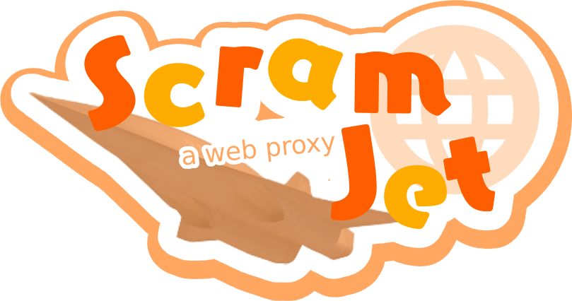

<h1 align="center">Scramjet</h1>
<div align="center">
  
</div>

<div align="center">
  <a href="https://www.npmjs.com/package/@mercuryworkshop/scramjet"></a>
  
  
</div>

---

Scramjet is an interception-based web proxy designed to bypass arbitrary web browser restrictions, support a wide range of sites, and act as middleware for open-source projects. It prioritizes security, developer friendliness, and performance.

## Supported Sites

Scramjet has CAPTCHA support! Some of the popular websites that Scramjet supports include:

- [Google](https://google.com)
- [Twitter](https://twitter.com)
- [Instagram](https://instagram.com)
- [Youtube](https://youtube.com)
- [Spotify](https://spotify.com)
- [Discord](https://discord.com)
- [Reddit](https://reddit.com)
- [GeForce NOW](https://play.geforcenow.com/)

Ensure you are not hosting on a datacenter IP for CAPTCHAs to work reliably along with YouTube. Heavy amounts of traffic will make some sites NOT work on a single IP. Consider rotating IPs or routing through Wireguard using a project like <a href="https://github.com/whyvl/wireproxy">wireproxy</a>.

An easy to deploy version of Scramjet can be found at [Scramjet-App](https://github.com/MercuryWorkshop/scramjet-app).

## Development

### Dependencies

- Recent versions of `node.js` and `pnpm`
- `rustup`
- `wasm-bindgen`
- [Binaryen's `wasm-opt`](https://github.com/WebAssembly/binaryen)
- [this `wasm-snip` fork](https://github.com/r58Playz/wasm-snip)

#### Building

- Clone the repository with `git clone --recursive https://github.com/MercuryWorkshop/scramjet`
- Install the dependencies with `pnpm i`
- Build the rewriter with `pnpm rewriter:build`
- Build Scramjet with `pnpm build`

### Running Scramjet Locally

You can run the Scramjet dev server with the command

```sh
pnpm dev
```

Scramjet should now be running at <http://localhost:1337> and should rebuild upon a file being changed (excluding the rewriter).

### Setting up Typedoc

The official Scramjet Typedoc gets deployed via GitHub Actions along with the demo site [here](https://scramjet.mercurywork.shop/typedoc).

You can run it locally with:

```
pnpm run docs
pnpm docs:dev
pnpm docs:serve
```

### Set up everything

Do you want to run the Scramjet demo and Typedoc together like what is served on GitHub Pages by the Action?

You can do this by running the serve script:

```sh
chmod +x scripts/serve-static.sh
./scripts/serve-static.sh
```

This essentially simulates the CI pipeline, but in a shell script.

## Resources

- [TN Docs](https://docs.titaniumnetwork.org/proxies/scramjet) - There's a page on TN's docs for Scramjet, which is structured more like a guide if you are an interested proxy site developer.
- [Scramjet Typedocs](https://scramjet.mercurywork.shop/typedoc) - Contains documentation for Scramjet APIs. This is useful for any proxy site developer.
- [Scramjet-App](https://github.com/MercuryWorkshop/scramjet-app) - A simple example of a proxy site, which uses Scramjet in a mass-deployable manner. This is based on [Ultraviolet-App](https://github.com/titaniumnetwork-dev/ultraviolet-app) for familiarity.
