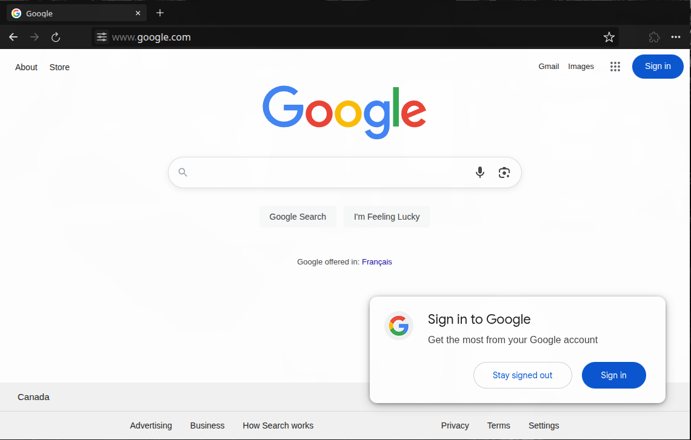

<h3 align="center"></h3>

<h3 align="center">Highly Configurable Browser Environment for the Web</h3>

    <a href="https://puter.com/app/puter-browser-beta"><strong>« LIVE DEMO »</strong></a>
     
     
    <a href="https://puter.com">Puter.com</a>
    ·
    <a href="https://discord.com/invite/PQcx7Teh8u">Discord</a>
    ·
    <a href="https://reddit.com/r/puter">Reddit</a>
    ·
    <a href="https://twitter.com/HeyPuter">X</a>

<h3 align="center"></h3>

 

# Browser.js

"A browser in a browser!", Browser.js is a highly configurable browser environment for the web.

It can be used as:

- An end-to-end encrypted, cloud-based browser accessible from any device at anytime
- A headless browser that can be embedded in other websites and applications
- A fast, lightweight, and no-installation alternative to Puppeteer, Playwright, and Selenium
- An alternative to Ultraviolet, Rammerhead, and other web proxy browsers

 

## Getting Started

See [CONTRIBUTING.md](/CONTRIBUTING.md) for build instructions

> [!WARNING]
> Browser.js does not currently have site isolation! Do not use it for sensitive data!

 

## Support

Connect with the maintainers and community through these channels:

- Bug report or feature request? Please [open an issue](https://github.com/HeyPuter/browser.js/issues/new/choose).
- Discord: [discord.com/invite/PQcx7Teh8u](https://discord.com/invite/PQcx7Teh8u)
- X (Twitter): [x.com/HeyPuter](https://x.com/HeyPuter)
- Reddit: [reddit.com/r/puter/](https://www.reddit.com/r/puter/)
- Mastodon: [mastodon.social/@puter](https://mastodon.social/@puter)
- Security issues? [security@puter.com](mailto:security@puter.com)
- Email maintainers at [hi@puter.com](mailto:hi@puter.com)

We are always happy to help you with any questions you may have. Don't hesitate to ask!

 

## License

This repository, including all its contents, sub-projects, modules, and components, is licensed under [AGPL-3.0](https://github.com/HeyPuter/puter/blob/main/LICENSE.txt) unless explicitly stated otherwise. Third-party libraries included in this repository may be subject to their own licenses.

 
